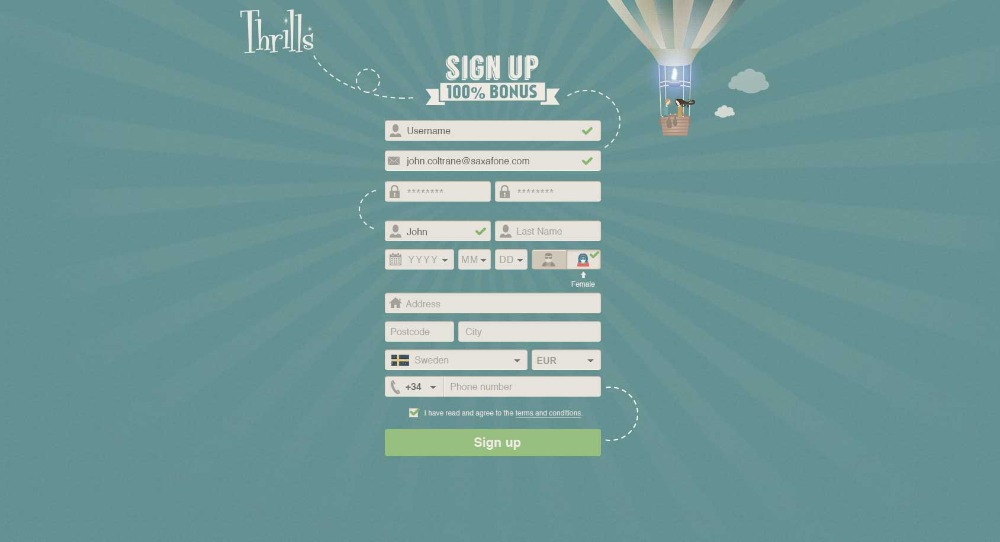
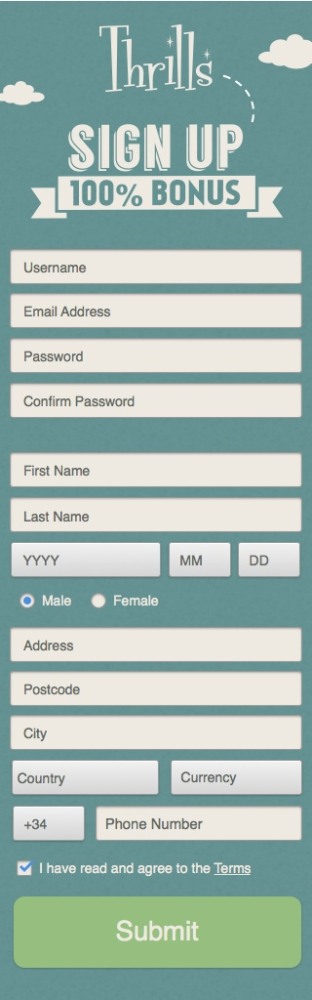

# UI Developer test

* [Intro](#intro)
* [Preparation and guides](#preparation-and-guides)
* [The objective](#the-objective)
    * [Desktop version](#desktop-version)
    * [Mobile version](#mobile-version)
* [What we are looking for](#what-we-are-looking-for)
* [Assets](#assets)

## Intro

You will be presented with two images, one of a registration form for desktop, and one for mobile.

## Preparation and guides
1. The test results should work for at least Chrome, Firefox and IE 10 and 11, as well as latest versions of iOS and Android.
    Some kind of access to those browsers will likely be needed.
2. We want you to use angular.js for one part of the test. Some knowledge of it will help. If you dont do javascript or using angular, please skip that part, and mention it when submitting.
4. You are not allowed to use any framework like for example `Bootstrap` or `Foundation`.
5. If you use a preprocessor, please include the source code when submitting the test.

## The objective

Your mission, should you choose to accept it:

1. Create a single html/css version of the two screens, fully responsive.
2. Make sure that it works for tablet as well, based on what you know of the desktop and mobile designs.
2. The desktop version should use custom dropdowns, as in the design.
3. The mobile version should trigger native form inputs.
3. The mobile version should somehow be divided into two steps.
4. Use angular.js to add fitting form validations.
4. Even though its a simple page, please structure files and code as if it was a big project
5. Add comments to your test, explaining your tools, ideas and conclusions.

### Desktop version

### Mobile version

## What we are looking for
1. Pixel perfection
2. We want to see how you work with responsive designs
3. We will analyse your file and code structure
4. We will see how you work with differences between mobile and desktop
5. We will see which tools you use, and how you use them.

## Assets
[Click here to download images](https://github.com/betit/tests/raw/master/ui-developer/assets.zip)

**Good Luck! :-)**
